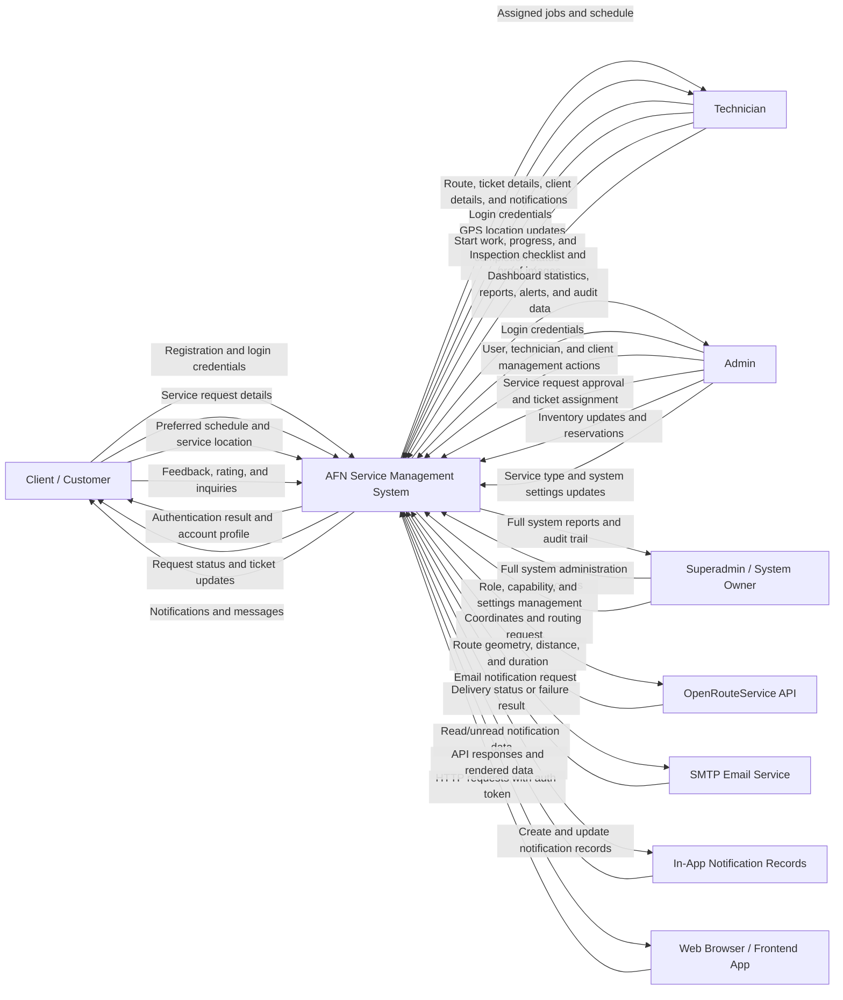

## Context Diagram

```mermaid
flowchart LR
    Client[Client / Customer]
    Technician[Technician]
    Admin[Admin]
    Superadmin[Superadmin / System Owner]

    ORS[OpenRouteService API]
    Email[SMTP Email Service]
    Notifications[In-App Notification Records]
    Browser[Web Browser / Frontend App]

    System[AFN Service Management System]

    Client -->|Registration and login credentials| System
    System -->|Authentication result and account profile| Client
    Client -->|Service request details| System
    Client -->|Preferred schedule and service location| System
    System -->|Request status and ticket updates| Client
    System -->|Notifications and messages| Client
    Client -->|Feedback, rating, and inquiries| System

    Technician -->|Login credentials| System
    System -->|Assigned jobs and schedule| Technician
    Technician -->|GPS location updates| System
    Technician -->|Start work, progress, and completion status| System
    Technician -->|Inspection checklist and proof images| System
    System -->|Route, ticket details, client details, and notifications| Technician

    Admin -->|Login credentials| System
    Admin -->|User, technician, and client management actions| System
    Admin -->|Service request approval and ticket assignment| System
    Admin -->|Inventory updates and reservations| System
    Admin -->|Service type and system settings updates| System
    System -->|Dashboard statistics, reports, alerts, and audit data| Admin

    Superadmin -->|Full system administration actions| System
    Superadmin -->|Role, capability, and settings management| System
    System -->|Full system reports and audit trail| Superadmin

    System -->|Coordinates and routing request| ORS
    ORS -->|Route geometry, distance, and duration| System

    System -->|Email notification request| Email
    Email -->|Delivery status or failure result| System

    System -->|Create and update notification records| Notifications
    Notifications -->|Read/unread notification data| System

    Browser -->|HTTP requests with auth token| System
    System -->|API responses and rendered data| Browser
```
